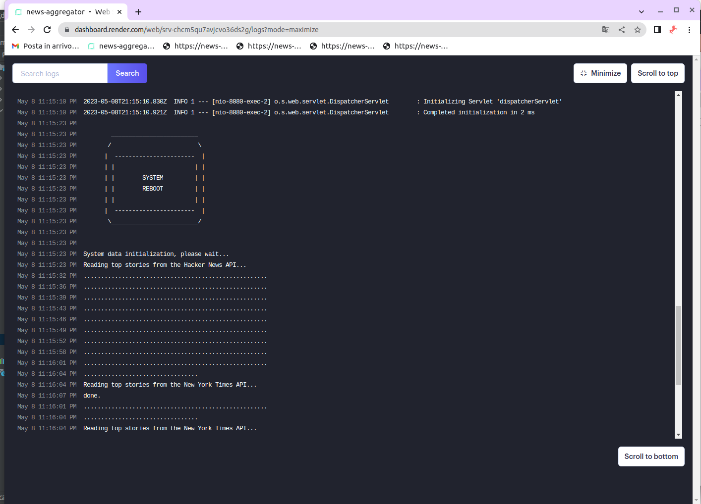

# News Aggregator Application

---

The News Aggregator is a microservice REST application written in Kotlin and hosted in the cloud. It aggregates news from multiple sources, including Hacker News and the New York Times Top Stories API. It provides two RESTful API endpoints: one for all aggregated news chronologically and one for news from a specific source. Additionally, this application utilizes the Jaro-Winkler distance algorithm, a measure of similarity between strings that improves the virality score of the news when they are aggregated.

---

## Problem Solving

### Description

We would like you to create a REST service that aggregates the top stories from news.ycombinator.com and the top stories from the technology section of the New York Times in a format that has the most information in common between the two sources (at least the title and URL).

### Specifications

• GET /news
returns the aggregated news ordered chronologically from the most recent to the least recent regardless of the source.

• GET /news/{source}
returns the news from the {source} source ordered in the same way.

• the output format must be json

• the service should not be authenticated

• you have no constraints on which version of java to use

• feel free to use any tools, frameworks, or libraries that are useful to you.

### Deliverables

• Make the source code of the application available on an online versioning system (github).

• Provide in a README the necessary information to enable anyone to build and run the service on their own computer.

• Only if you find it necessary, in the README, write two lines about the choices you made.

### Bonus

• Add a persistence layer to save the aggregation with some logic to update it with live data from the sources.

• Create a Dockerfile for a self-contained service image.

• Publish the service created on a PaaS

### References
1. news.ycombinator.com https://github.com/HackerNews/API
The endpoints you are interested in are /v0/topstories and /v0/item/<id>.
This API does not require authentication.
New York Times.

2. http://developer.nytimes.com/ You can use the top_stories service and your apikey.

---

## APIs call from Render

- https://news-aggregator-h7g4.onrender.com/news
- https://news-aggregator-h7g4.onrender.com/news/hackernews
- https://news-aggregator-h7g4.onrender.com/news/newyorktimes

---

## Example of response from /news:

```
{
    "titleHackerNews": "Sam Bankman-Fried, in first detailed defense, seeks to dismiss charges",
    "urlHackerNews": "https://www.nytimes.com/2023/05/08/technology/sam-bankman-fried-defense.html",
    "byHackerNews": "crhulls",
    "dateHackerNews": "2023-05-09T04:44:09Z",
    "titleNewYorkTimes": "Sam Bankman-Fried, in First Detailed Defense, Seeks to Dismiss Charges",
    "urlNewYorkTimes": "https://www.nytimes.com/2023/05/08/technology/sam-bankman-fried-defense.html",
    "byNewYorkTimes": "By David Yaffe-Bellany and Matthew Goldstein",
    "dateNewYorkTimes": "2023-05-08T23:34:21Z",
    "matchedInfo": 2,
    "latestDate": "2023-05-09T04:44:09Z"
}
```

---

## Getting Started

To run the News Aggregator application on your local machine, you need to have Gradle installed. Once you have installed these dependencies, follow the instructions below:

1. Clone the repository: `git clone https://github.com/RunMyProject/news-aggregator`
2. Navigate to the project directory: `cd news-aggregator`
3. Build the application: `./gradlew build`
4. Start the application: `./gradlew bootRun`
5. Access the endpoints by making HTTP GET requests to the following URLs:
    - `http://localhost:8080/hello`: returns a simple greeting message.
    - `http://localhost:8080/news`: returns all aggregated news chronologically.

If you want to use your own API key, add a file named `ApiKey.properties` to the `src/main/resources` directory with the following content:

```
nytimes.api.key=XXXXXXXXXXXXXXXXXXXXXXXXXXXXXXXX
```

Alternatively, you can store the API key using the following endpoint:
- `http://localhost:8080/storeapikey/YOUR_API_KEY_HERE`: stores the provided API key in the system for future use.

---

## Setting the `nytimes_api_key` Environment Variable

### Cloud Example

If you are using a cloud provider like Render, you can set the `nytimes_api_key` environment variable in your application settings. Here's an example of how to do it on Render:

1. Go to your app's dashboard on Render.
2. Click on "Settings" in the left sidebar.
3. Scroll down to the "Environment Variables" section.
4. Click on "Add Environment Variable".
5. Enter "nytimes_api_key" as the name and your API key as the value.
6. Click on "Save".


After setting the `nytimes_api_key` environment variable, you can retrieve it in your Kotlin application using `val apiKey = getenv("nytimes_api_key")`.

### Linux Example

If you are running your Kotlin application on a Linux system, you can set the `nytimes_api_key` environment variable using the `export` command. Here's an example of how to do it in a terminal:

```
$ export nytimes_api_key=YOUR_API_KEY_HERE
```

After setting the `nytimes_api_key` environment variable, you can retrieve it in your Kotlin application using `val apiKey = getenv("nytimes_api_key")`.

---

## Release on your PaaS

Once you have released your application on your preferred PaaS (in this case, I used the cloud provider Render), if the API has been uploaded correctly, you should see a screen like the one below and wait for the loading to finish (done).

In the screen below:



---

## Improving News Virality Scores with Jaro-Winkler Similarity: A Microservice Approach

The Jaro-Winkler distance algorithm and the Damerau-Levenshtein distance algorithm are both measures of similarity between two strings, but they differ in their approach and the type of errors they account for.

The Jaro-Winkler distance algorithm is primarily designed for use in record linkage applications where it is important to distinguish between two strings that are almost identical and those that are completely different. It considers the number of matching characters, the number of transpositions, and the length of common prefixes between the two strings.

On the other hand, the Damerau-Levenshtein distance algorithm is a more general measure of edit distance between two strings. It accounts for the number of insertions, deletions, substitutions, and transpositions required to transform one string into another.

In the case of the News Aggregator, the Jaro-Winkler distance algorithm was chosen because it provides a more nuanced measure of similarity between two strings that is better suited for news articles. The algorithm gives more weight to common prefixes, which often include key terms or names that are important for identifying similar articles. The Damerau-Levenshtein distance algorithm, on the other hand, may give too much weight to minor differences in spelling or grammar, which may not be as important for identifying similar news articles.

Overall, the choice of distance algorithm depends on the specific use case and the type of similarity that is important to measure. In the case of the News Aggregator, the Jaro-Winkler distance algorithm was found to be more accurate in measuring similarity between news articles than the Damerau-Levenshtein distance algorithm.

---

## Description of News Aggregator Application Architecture

The News Aggregator application is designed as a microservice architecture that uses a RESTful API to provide access to its functionality. The application is built using the Kotlin programming language and the Spring Boot framework. The source code of the application is organized into several packages, each of which contains a set of related classes.

Here is an overview of the application's package structure:

- `com.render.newsaggregator`: contains the `NewsAggregatorApplication.kt` class, which starts the Spring Boot framework and initializes the application's components.
- `com.render.newsaggregator`: contains the `NewsController.kt` class, which defines the RESTful endpoints of the application.
- `com.render.newsaggregator.config`: contains the `Config.kt` class, which defines the application's configuration.
- `com.render.newsaggregator.exception`: contains the `InvalidAPIException.kt` and `InvalidSourceException.kt` classes, which handle the exceptions thrown by the application.
- `com.render.newsaggregator.model`: contains the classes that define the application's data models, such as `Article.kt`, `News.kt`, `Item.kt`, `Result.kt`, and `TempNews.kt`.
- `com.render.newsaggregator.utility`: contains the classes that provide auxiliary functionality, such as `ParseExtractorData.kt` and `Similarity.kt`.
- `com.render.newsaggregator.persistence`: contains the classes that provide persistence functionality, such as `Persistence.kt` and `PersistenceScheduling.kt`.

The News Aggregator application also includes persistence functionality to store the API keys and scheduling functionality to update the news periodically.

The application provides several endpoints for accessing news data:

- `/news`: returns all aggregated news chronologically.
- `/news/{source}`: returns news from a specific source (newyorktimes or hackernews).
- `/hello`: returns a simple greeting message.
- `/storeapikey/{apiKey}`: stores the provided API key in the System for future use.

The application uses logging to track its performance and to help debug issues. It also uses external APIs to fetch news data from different sources.

---

## Description of the ParseExtractorData.kt

The `ParseExtractorData` class is a utility class that provides methods for parsing data from various news sources. This class also utilizes other utility classes such as `Jaro` which is found in the `Similarity.kt` class, which implements the Jaro-Winkler distance algorithm, a measure of similarity between strings. Additionally, the class uses the Jackson library for serialization and deserialization of JSON objects and the OkHttp library for HTTP requests.

The `ParseExtractorData` class provides several useful methods, including the ability to make HTTP requests to news sources (the `createRequest` method), execute HTTP requests (the `executeRequest` method), and obtain the response as corresponding objects (the `parseIdArrayResponse`, `parseItemResponse`, and `parseArrayResponseArticle` methods). Furthermore, the class also provides a method to obtain the publication date of news from the corresponding objects (the `getHackerNewsDateFromItem` and `getDateFromResult` methods).

Finally, the `ParseExtractorData` class also provides a method to compare news from different sources and return a score indicating their similarity (the `compareNews` method), using the Jaro-Winkler distance algorithm. The news aggregation algorithm takes into account this aspect and assigns a virality score to the news based on the number of sources from which it was reported and the similarity between the news themselves. In this way, the most important and relevant news for the public will be prioritized in the presentation of information.

---

## Description of the PersistenceScheduling.kt

The `PersistenceScheduling.kt` class is a Kotlin class that provides functions to schedule data persistence at fixed intervals using Java serialization. It is located in the `com.render.newsaggregator.persistence` package.

The class imports exceptions, models, libraries, and configurations required for its functions. The exceptions imported are `InvalidAPIException` and `InvalidSourceException`. The models imported are `News` and `TempNews`. The libraries imported are `Persistence` and `ParseExtractorData`. The configurations imported are `Config`.

The class has a constructor that takes an API key as a parameter. It also has a `PersistenceConstants` object that defines a constant `PERSISTENCE_INTERVAL` in milliseconds for the persistence interval. The class also has a `companion object` with three variables: `isFileLocked`, `apiKey`, and `isInitialized`.

The class has a `myLog` and a `myLogln` function for logging messages. These functions print messages to the console only if the `isInitialized` variable is `false`.

The class has two functions: `getHackerNewsTopStories` and `getNewYorkTimesTopStories`. The `getHackerNewsTopStories` function retrieves top stories from the Hacker News API and returns them as a list of `TempNews`. The `getNewYorkTimesTopStories` function retrieves top stories from the New York Times API and returns them as a list of `TempNews`.

The class has a `run` function that starts the persistence scheduling process. This function saves and loads data to/from a file at fixed intervals. The function runs in an infinite loop, saving data to a file and sleeping for the interval defined in `PersistenceConstants.PERSISTENCE_INTERVAL`.

The class also has a `saveDataToFile` function that saves the data to a file using Java serialization. This function retrieves top stories from the Hacker News API and the New York Times API and saves them to files with predefined names. The function also sets the `isFileLocked` variable to `true` during execution and sets it to `false` after completion. The function also sets the `isInitialized` variable to `true` after the first execution of the function.

---

## Description of NewsController.kt

This class defines two endpoints for retrieving news data from two sources: Hacker News and the New York Times Top Stories API. It imports several classes related to news aggregation and analysis, such as exceptions, models, persistence, and libs.

The class is annotated with the **@RestController** annotation, which is a Spring annotation indicating that this class will handle HTTP requests and send HTTP responses. Inside the class, there are two functions annotated with **@GetMapping**, which correspond to the two endpoints: **getMergedNews()** and **getNewsBySource()**.

The **getMergedNews()** function retrieves the data from both sources, compares them, and returns a list of News objects. The function first checks if the API key for the New York Times Top Stories API is present in the PersistenceScheduling object. Then, it loads the data from the two sources using the Persistence.loadData() function. The data from the two sources are then compared using the ParseExtractorData.compareNews() function, which returns a value indicating how similar the two news items are. If the similarity score is greater than or equal to 2, the two news items are merged into a News object, which is added to a list. The resulting list is sorted by the similarity score and the latest date.

The **getNewsBySource()** function retrieves the data from either Hacker News or the New York Times Top Stories API, depending on the value of the source parameter. The function first checks if the API key for the New York Times Top Stories API is present in the PersistenceScheduling object if the source is the New York Times. Then, it loads the data from the corresponding file using the Persistence.loadData() function. The resulting list is sorted by the date.

The file also contains several imports, including exceptions, models, persistence, libs, and configuration.

---

## Description of NewsaggregatorApplication.kt

The application utilizes the Spring framework to handle HTTP requests and implement a RESTful service.

The class contains a **main()** function that loads the API key required to access news. If the API key is valid, the persistence service thread is started to save news. Otherwise, an error message is returned.

The class also defines a **NewsaggregatorController** class to handle HTTP requests. The controller has two endpoints: **hello()** and **storeApiKey()**. The **hello()** endpoint returns a simple greeting message if the API key is valid and not empty, otherwise an error message is returned. The **storeApiKey()** endpoint stores the API key in memory and returns a success or error message.

Additionally, the class imports the necessary classes for data persistence (PersistenceScheduling), handling HTTP requests with Spring (**@RestController**, **@GetMapping**, **ResponseEntity**, **HttpStatus**), and some standard Java classes (**File**, **Properties**, **URL**).

---

## Conclusion

The News Aggregator application is a robust and scalable microservice that provides easy access to news data from various sources. It can be easily deployed and scaled on Render PaaS, making it an ideal solution for small and large-scale projects.
